#  DevSecOps
<h1 align="center">
  <br>
  <a href="https://github.com/SaifRehman/devsecops-pipeline"></a>
  <br>
      Sample Web Application with DevSecOps Pipeline 
  <br>
  <br>
</h1>

<h4 align="center">Powered by IBM Kubernetes Service, IBM Application Security, and Jenkins</h4>

<p align="center">
  <a>
    
  </a>
</p>
<br>

## Learning Objectives?
1. Understand basic Kubernetes and Docker concepts
2. Using IBM Kubernetes Service
3. Deploying application to Kubernetes
4. Building and creating Dockerfile
5. Container and Application Security
5. Implementing a DevSecOps Continous Delivery pipeline using Jenkins, IBM Application Security, GitHub, and Aqua Micro-Scanner

## Prerequisites
1. Signup to [IBM Cloud](https://ibm.biz/devsecops)
2. Signup to [IBM Application Security Free Trial](https://www.ibm.com/ae-en/marketplace/application-security-on-cloud)
3. Signup to [Github](https://github.com/)
4. Signup to [Docker Hub](https://hub.docker.com/)
5. Install [Kubectl](https://kubernetes.io/docs/tasks/tools/install-kubectl/)
6. Install [Docker](https://docs.docker.com/install/)
7. Install [IBM Cloud CLI](https://console.bluemix.net/docs/cli/reference/ibmcloud/download_cli.html#install_use)
8. Install [GitCli](https://git-scm.com/book/en/v2/Getting-Started-Installing-Git)
## What are we building?
Sample Angular Application where building, security testing, and deployment of the application is automated.  

## Application Architecture


#### Featured technologies
1. [Angular4](https://angular.io/):- Angular is a platform that makes it easy to build applications with the web. Angular combines declarative templates, dependency injection, end to end tooling, and integrated best practices to solve development challenges
2. [Nodejs](https://nodejs.org/en/):- An open-source JavaScript run-time environment for executing server-side JavaScript code.
3. [Typescript](https://www.typescriptlang.org/):- TypeScript is an open-source programming language developed and maintained by Microsoft. It is a strict syntactical superset of JavaScript, and adds optional static typing to the language
4. [Docker](https://www.docker.com/):- Docker is an open platform for developers and sysadmins to build, ship, and run distributed applications, whether on laptops, data center VMs, or the cloud.
5. [Kubernetes](https://kubernetes.io/):- Kubernetes is an open-source system for automating deployment, scaling, and management of containerized applications
6. [Jenkins](https://jenkins.io/):- Jenkins is an open source automation server written in Java. Jenkins helps to automate the non-human part of the software development process, with continuous integration and facilitating technical aspects of continuous delivery.
7. [IBM Application Security ](https://www.ibm.com/ae-en/marketplace/application-security-on-cloud):- IBM Application Security on Cloud is a cloud app security offering that helps secure your organization's Web, cloud, mobile, and other applications. It detects dozens of today's most pervasive security vulnerabilities and enhances your application security.
8. [Aqua Micro Scanner](https://github.com/aquasecurity/microscanner):- Aqua Security's MicroScanner lets you check your container images for vulnerabilities. If your image has any known high-severity issue, MicroScanner can fail the image build, making it easy to include as a step in your CI/CD pipeline.
9. [Docker Cloud](https://cloud.docker.com/):- Docker Cloud is the name of the new cloud service by Docker that expands on the features of Tutum, brings a tighter integration with Docker Hub, and provides new updates and fixes
10. [Github](https://github.com/):- GitHub Inc. is a web-based hosting service for version control using Git. It is mostly used for computer code

### Setting a Cluster in IBM Kubernetes Service
1. Go to [IBM Cloud console](https://console.bluemix.net/dashboard/apps/)
2. Navigate to containers


3. Click on create new cluster


4. Name your cluster and create a cluster, wiat for few minutes to get it fully deployed. After it is fully deployed click on the cluster

 
* This shows overview of your deployed cluster 
5. Click on Access tab and follow the instruction on the website
6. Install the container service plugin.
```
$ ibmcloud plugin install container-service -r Bluemix
```
7. Log in to your IBM Cloud account.
```
$ ibmcloud login -a https://api.eu-de.bluemix.net
$ ibmcloud cs region-set eu-central
```
7. Set the context for the cluster in in your CLI.
* Get the command to set the environment variable and download the Kubernetes configuration files.
```
$ ibmcloud cs cluster-config NameOfYourCluster
```
* Set the KUBECONFIG environment variable. Copy the output from the previous command and paste it in your terminal. The command output should look similar to the following.
8.  Verify that you can connect to your cluster by listing your worker nodes
```
$  kubectl get nodes
```


> You will be able to access your cluster now hosted in IBM Kubernetes Service

### Fork the repo
1. Fork the [DevSecOps Repo](https://github.com/SaifRehman/devsecops-pipeline)
2. Clone your forked repo locally

### Deploy Jenkins to Kubernetes Cluster
1. Navigate to ```jenkins``` folder 
2. Deploy ```Kubernetes Deployment``` and ```Kubernetes services```
```
$ kubectl create -f jenkins.yml
```
3. Check if its deployed and running 
```
$ kubectl get pods
```


> This mean jenkin pod is up and running sucessfully
4. Check ip to access, go to your cluster and note down ip

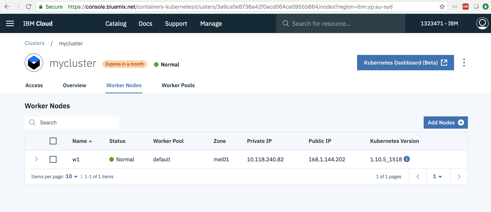

> jenkins is hosted in port 30012

5. You will be able to access jenkins http://ip:30012

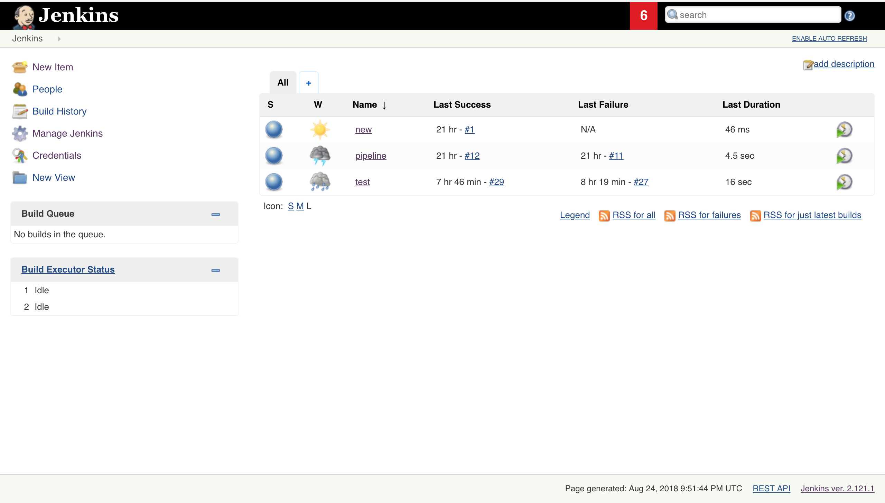

6. Install required plugin to create our first pipeline. Go to ``` Manage Jenkins ```, then click on ``` Manage Plugins ```, select ``` available tab ```

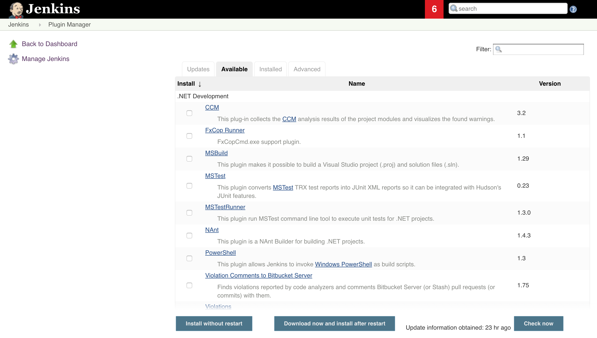

> you will see something like this

* Install plugin ```Custom Tools Plugin```
* Install plugin ```GitHub Integration Plugin```
* Install plugin ```IBM Application Security on Cloud```
* Install plugin ```Pipeline```
 > Note: this jenkins has aready installed kubectl and docker 
### Configuring Aqua vulneribility Scanner
1. Go to this link, sign up and get the token in your email ```https://microscanner.aquasec.com/signup```
2. Replace ```xxx``` in line 19 with your api key

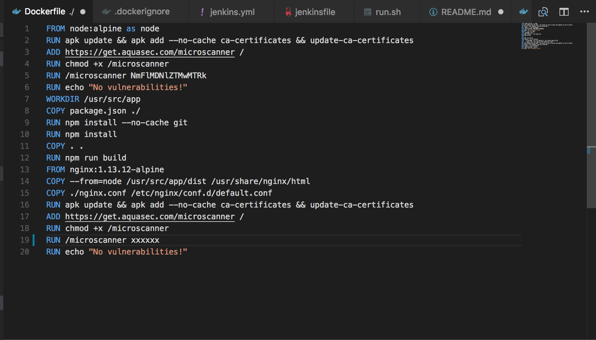

### Connecting Github to DockerCloud for autonomous image build and push
1. Go to [Docker Cloud](https://cloud.docker.com/) and sign in, then click on ```repository tab ```
2. Click on your name on top right side and select ``` Personal Settings```
3. Select ```Service Providers```
4. Then go ``` linked accounts ``` and activate github


5. Click on ```repositories``` on top tab, click on create

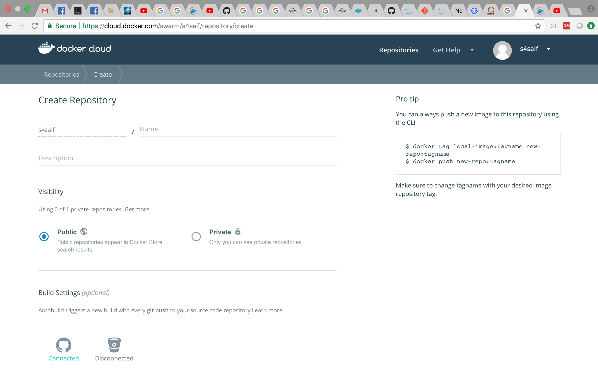

6. Give name to your docker image, then click on ```github icon```, select ```organization``` then select the repository you forked

> You are all set! Lets double check!

7. Go to your forked github repo, select ```settings```, select ```webhooks```, you will see a webhook created automagically ;)

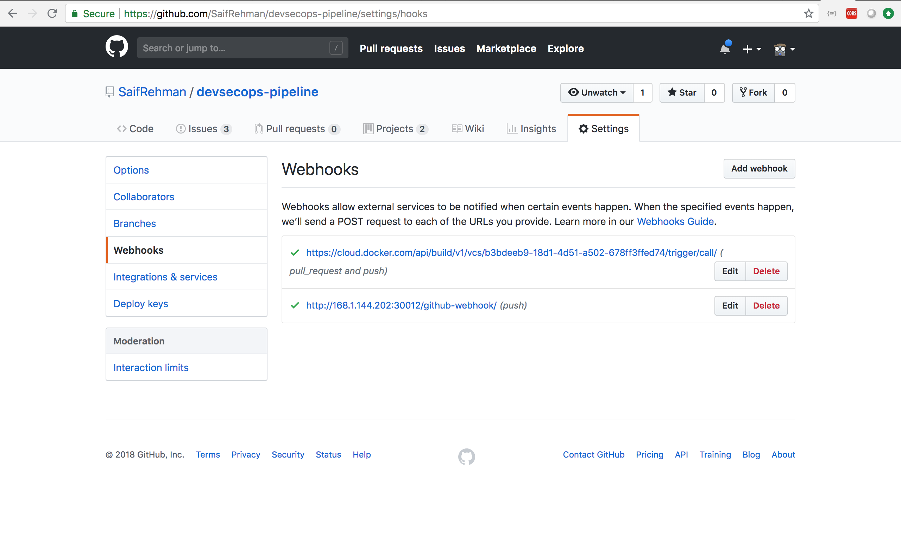

> Now if you commit and push to github image build will be triggered automagically ;)

8. Go to ```Docker cloud```, select your image and click on ```timeline```

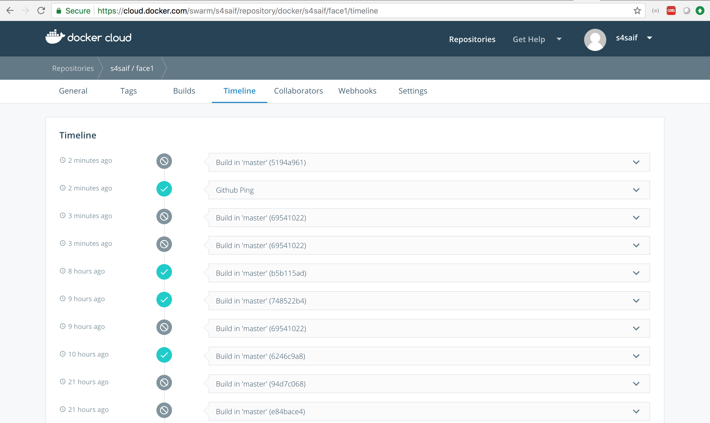

### Connecting Jenkins with Kubernetes for automated deployment once image is built
#### Confguring jenkins pod
1. Configure kubectl in jenkins pod
```
$ kubectl get pods
```
> note down pod name

2. Copy .pem and .yml file provided by IBM Kubernetes service to jenkins pod in ```/bin``` directory 
3. Note down where cluster configuration files are hosted
```
$ ibmcloud cs cluster-config mycluster
```
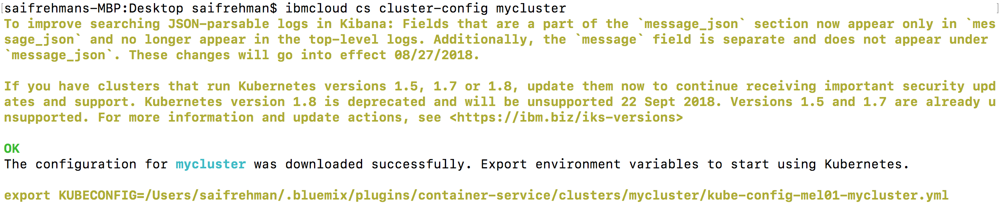
4. copy both pem and .yml file
```
$ kubectl cp /Users/saifrehman/.bluemix/plugins/container-service/clusters/mycluster/kube-config-mel01-mycluster.yml podname:/bin
$ kubectl cp /Users/saifrehman/.bluemix/plugins/container-service/clusters/mycluster/ca-mel01-mycluster.pem podname:/bin
```
> this is example, your files may have different names
5. ssh to your cluster, and set the kubeconfig
```
$ kubectl exec -it podname /bin/bash
$ export KUBECONFIG=/bin/kube-config-mel01-mycluster.yml
```
6. Go to service-deployent.yml file and replace image with name of your image you created ```yourid/imagename```
> check line 14
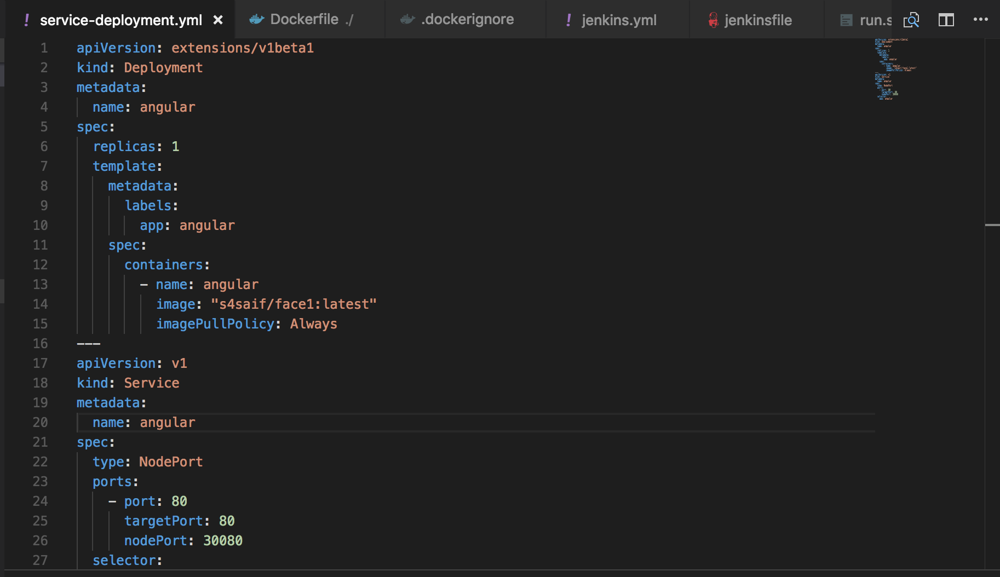

#### Configure webhook
1.  Go to your forked github repo, select ```settings```, select ```webhooks```, create a webhook, select ```application.json```
2. Set your ```project URL```. This is your jenkinsip:30012/github-webhook/ 
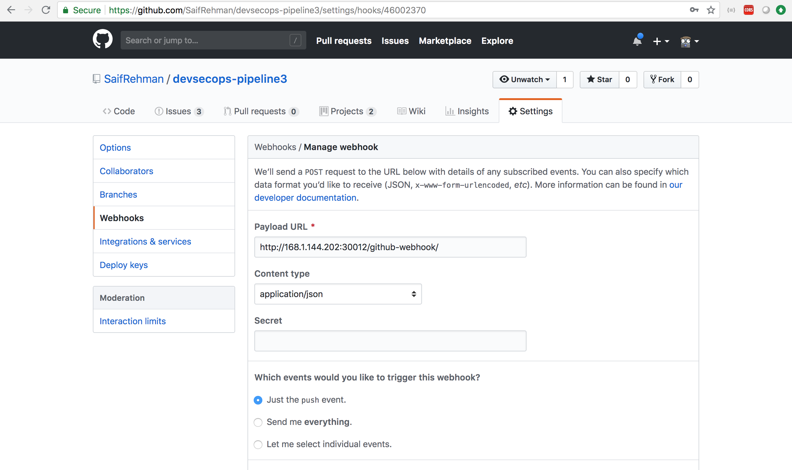

####  Creating your first jenkins pipeline 
1. Go to your ```ip:30012``` which has your jenkins installation
2. Click ```New Item```, name your project and select ```freestyle project```
3. Select ```GitHub Project```, and add your github link
 
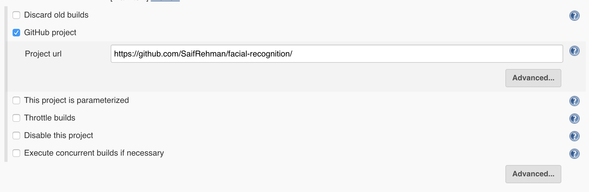
 
4. From ```Source Code Management``` select ```Git```. Add your repository git url

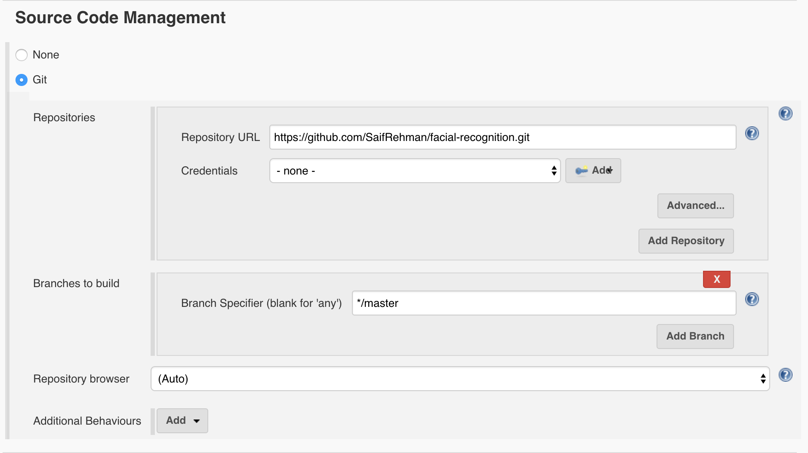

5. From ```Build Triggers```, select ```GitHub hook trigger for GITScm polling```
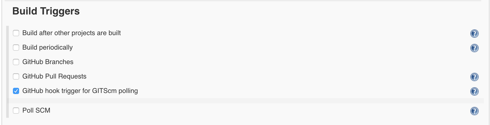

6. Click on add build step, select ```execute shell``
7. Paste in following code 
```sh
#!/bin/bash
sleep 700
echo 'hello'
if [ ! -d "devsecops-pipeline" ]; then
 su - root -c 'git clone https://github.com/SaifRehman/devsecops-pipeline.git'
fi
su - root -c "cd devsecops-pipeline && git pull && export KUBECONFIG=/bin/kube-config-mel01-mycluster.yml && kubectl delete deployments angular && kubectl apply -f service-deployment.yml"
```
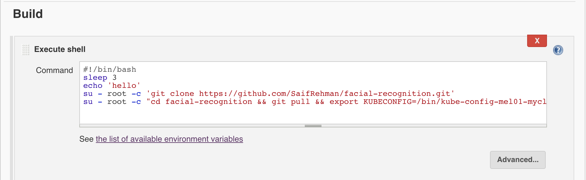
> you will have different github link, and different KUBECONFIG
8. Click on ``` Apply```, then click on ```Save```

### Configure IBM Application Security with jenkins
1. Sign in [IBM Application Security](https://appscan.ibmcloud.com/AsoCUI/serviceui/home)
2. Click on hamburger menu and select ```settings/api```
3. Click generate, note down both ```id``` and ```secret```

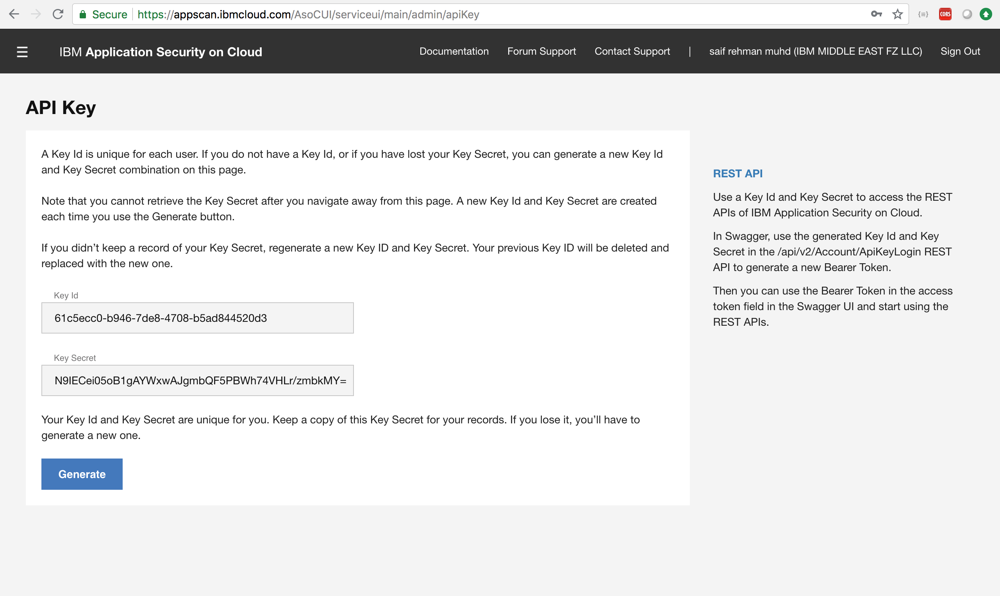
> Note:- dont share the credentials :)
> It will ask you to download ```DomainVerification.html```. download that and add it ```src``` folder

4. Go to your jenkins instance
5. Click on ```Credential```, then click on ```system```, then click on ``` Global credentials (unrestricted)```, select ```add credential```
6. Select ```IBM Application Security on Cloud Credentials``` from ```kind```
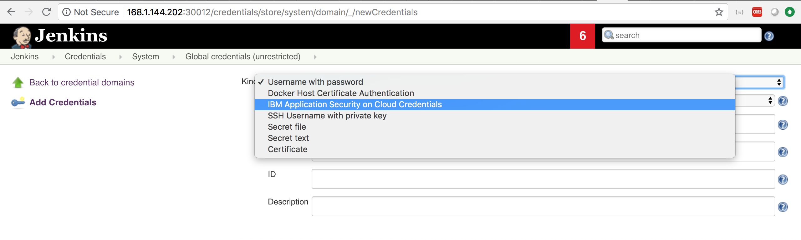
7. Add valid credential you obtained.
8. Click ok
9. Go to jenkins homepage. Select your freestyle project you created. Click on ```configure```
10. scroll down and click on. Click on ``` Add Build step```, select ```Run Security Test```
11. Select the credentials you set before
12. Give application name, and test name
13. Select ```dynamic analyzer ``` from test type 

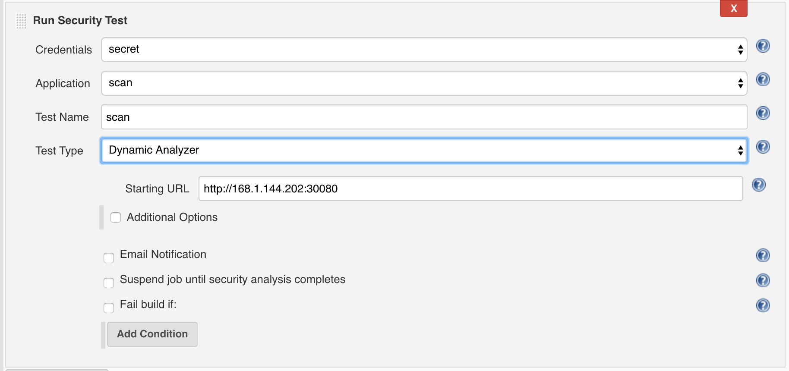

14. Click on ``` Apply```, then click on ```Save```
> you are all set :)

Go to **IBM Application Security on Cloud**, then go to ```My Scan``` from hamburger menu. you can see all your scans which were automatically generated

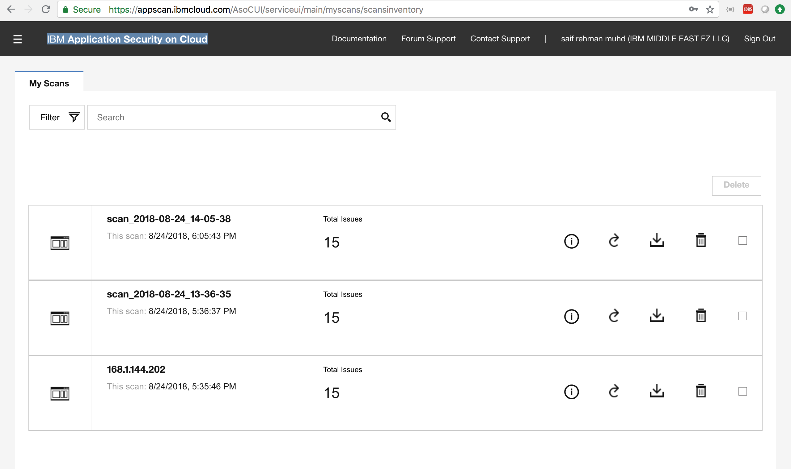

You can now download a sample report and look at it 

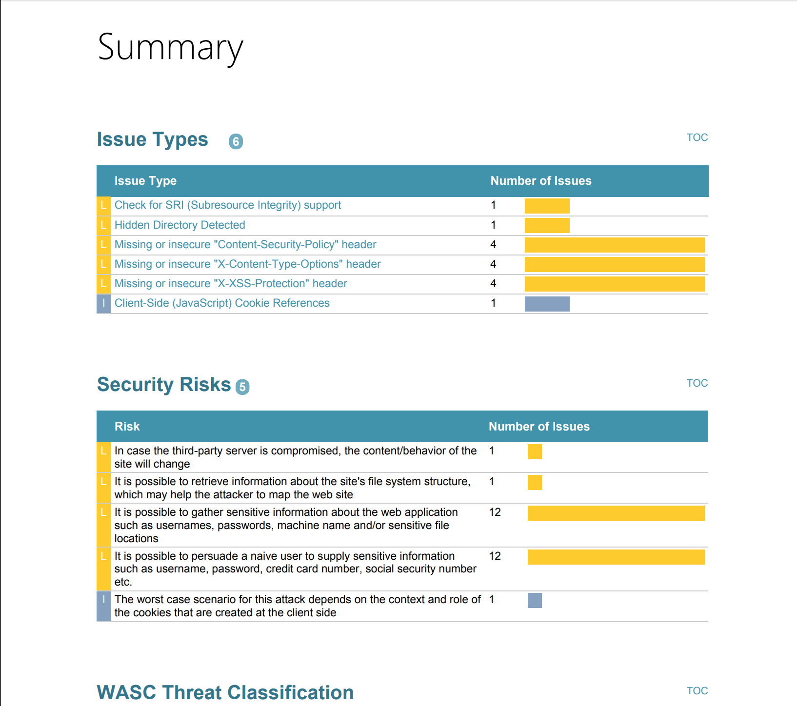

### Future work 
1. Implement docker image build in jenkins
2. More to come, cant think of any now :P

# Conclusion
You were able to create a end to end simple continuous deployment pipeline with test driven security. 


